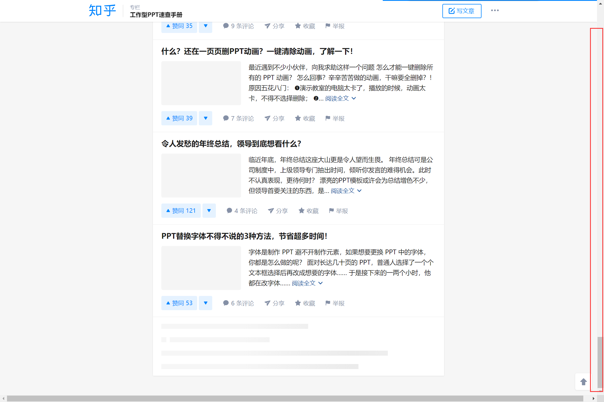
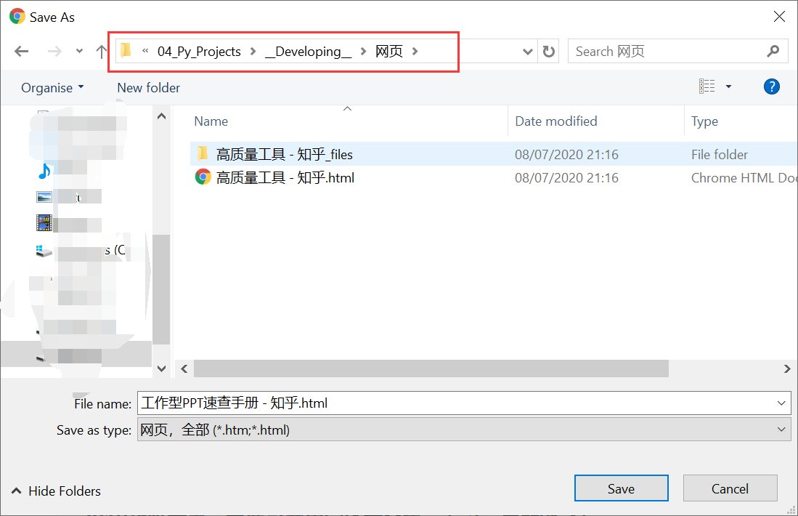
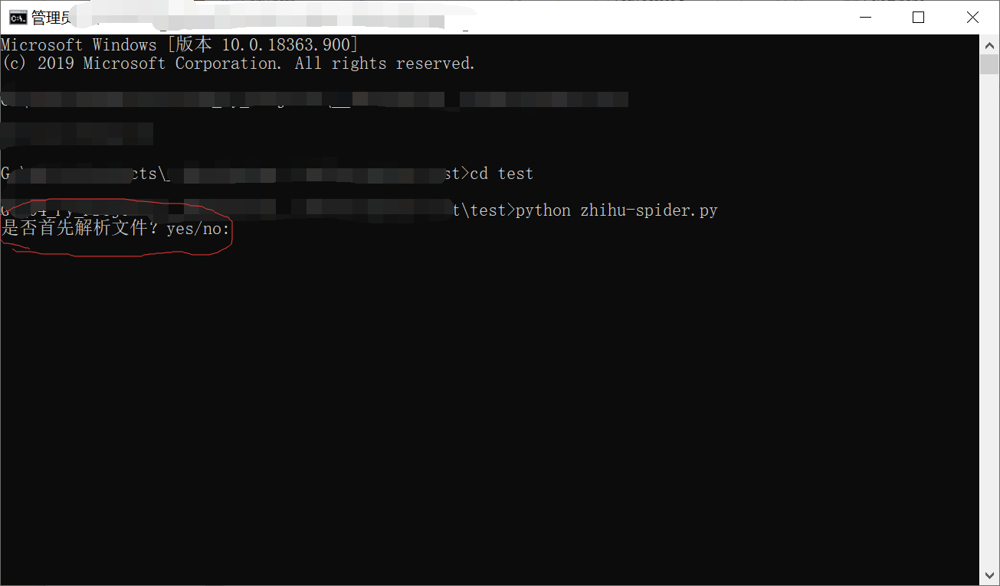
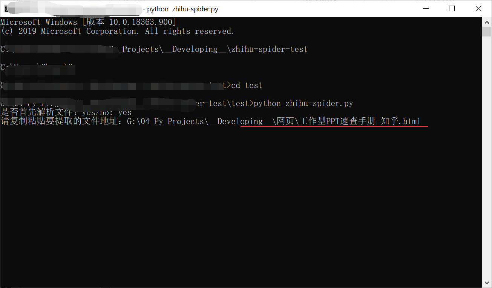

# 使用说明
### 功能:
获取知乎专栏下所有文章
有时候,看到别人写的文章实在是太好看了,忍不住想要下载下来反复观摩,仔细研究研究,但是文章太多又不好一个个去点开。
蹬蹬蹬蹬,到它出场的时候了。
#### 步骤
1. 浏览器登录之后,并找到目标专栏,比如说这个:
我平时喜欢做个PPT什么的,秦阳的PPT速查手册真不要太有用了!!盘他!!

2. 继续往下滑动,把所有的界面都加载出来(这部分懒得写代码弄了,其实是不会写....)
 然后一直到最下面滑不动了为止

3. 然后确保已经到底了,那么咱们就把网页另存为一个html文件
 并记住存储的路径

4. 然后,咱们就可以开始让代码来完成后面的部分啦,嘿嘿
win + r 然后输入cmd,回车, 然后输入: <code>cd G:\project\zhihu-spider-test</code>这里的路径名是我自己存储脚本文件的位置,你要输入自己的文件位置哦
5. 然后输入: <code>python zhihu-spider.py</code>开始运行。然后首先解析文件,输入:yes

6. 将刚才保存网页的文件地址完整复制进去,回车
